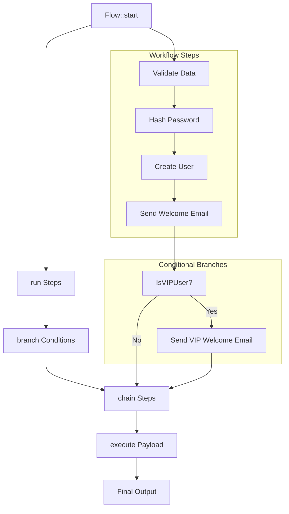

# Laravel Flows

<!-- BADGES_START -->
[![PHP Version][badge-php]][php]
[![Latest Version][badge-release]][packagist]
[](https://github.com/JustSteveKing/laravel-flows/actions/workflows/tests.yml)
[](https://github.com/JustSteveKing/laravel-flows/actions/workflows/formats.yml)
[](LICENSE)
[![Total Downloads][badge-downloads]][downloads]

[php]: https://php.net
[downloads]: https://packagist.org/packages/juststeveking/laravel-flows
[packagist]: https://packagist.org/packages/juststeveking/laravel-flows

[badge-release]: https://img.shields.io/packagist/v/juststeveking/laravel-flows.svg?style=flat-square&label=release
[badge-php]: https://img.shields.io/packagist/php-v/juststeveking/laravel-flows.svg?style=flat-square
[badge-downloads]: https://img.shields.io/packagist/dt/juststeveking/laravel-flows.svg?style=flat-square&colorB=mediumvioletred
<!-- BADGES_END -->

A fluent, modular workflow builder for Laravel that leverages the Pipeline pattern to simplify and organize business logic.

## Introduction

Flows is a lightweight Laravel package designed to turn complex, multi-step business logic into an elegant, maintainable workflow.
With a fluent API, you can easily chain steps, incorporate conditional logic, and keep your code modular and testable—perfect for any process that needs a well-orchestrated flow.

## Features

- **Fluent API**: Easily chain workflow steps using methods like `run()`, `branch()`, `chain()`, and the new `runIf()`.
- **Conditional Branches**: Integrate custom conditions using your own implementations of `FlowCondition`.
- **Testable & Modular**: Each step is isolated, making it a breeze to unit test and maintain.

## Installation

Install the package via composer:

```shell
composer require juststeveking/laravel-flows
```

## Usage

### Basic Usage

Create a simple workflow to process your payload:

```php
use JustSteveKing\Flows\Flow;
use App\Flows\Steps\DummyStep;

$result = Flow::start()->run(
    action: DummyStep::class,
)->execute(
    payload: 'Initial payload',
);
```

### Advanced Workflow with Conditional Branches

Leverage branch steps to conditionally execute parts of your workflow:

```php
use JustSteveKing\Flows\Flow;
use App\Flows\Conditions\IsSupplier;
use App\Flows\Steps\CommonStep;
use App\Flows\Steps\SupplierStep;

$result = Flow::start()->run(
    action: CommonStep::class,
)->branch(
    condition: IsSupplier::class,
    callback: fn(array $payload): array => Flow::start()->run(
        action: SupplierStep::class,
    )->execute(payload: $payload),
)->execute(payload: $payload);
```

### Real-World Example: User Registration

The workflow starts with basic tasks: validating the registration data, hashing the password, creating the user, and sending a welcome email.

It then uses a branch to conditionally run a sub-workflow (sending a VIP welcome email) if the condition `IsVIPUser` evaluates to `true`.

Finally, it logs the registration event before returning the processed data.

```php
<?php

declare(strict_types=1);

namespace App\Workflows;

use App\Flows\Flow;
use App\Flows\Conditions\IsVIPUser;

final class UserRegistrationWorkflow
{
    /**
     * Run the user registration workflow.
     *
     * @param array $registrationData
     * @return array Processed registration data
     */
    public static function run(array $registrationData): array
    {
        return Flow::start()
            ->run(\App\Workflows\Steps\ValidateRegistrationData::class)
            ->run(\App\Workflows\Steps\HashPassword::class)
            ->run(\App\Workflows\Steps\CreateUser::class)
            ->run(\App\Workflows\Steps\SendWelcomeEmail::class)
            ->branch(
                condition: IsVIPUser::class,
                callback: fn(array $data): array => Flow::start()
                    ->run(\App\Workflows\Steps\SendVIPWelcomeEmail::class)
                    ->execute($data)
            )
            ->run(\App\Workflows\Steps\LogRegistration::class)
            ->execute($registrationData);
    }
}
```

## How to use this package

This package defines a couple of core interfaces that helps you to build consistent, testable, and modular workflows.
By implementing these interfaces, you ensure that every step and condition in your workflow follows a predictable contract.

### FlowStep Interface

The `FlowStep` interface ensures that every workflow step implements a standard `handle` method. This method receives a payload and a closure representing the next step. This makes it super easy to chain multiple actions together.

#### Interface Definition

```php
namespace JustSteveKing\Flows\Contracts;

use Closure;

interface FlowStep
{
    /**
     * Process the payload and pass it to the next step.
     *
     * @param mixed   $payload
     * @param Closure $next
     * @return mixed
     */
    public function handle(mixed $payload, Closure $next): mixed;
}
```

#### Usage Example

WHen creating a new workflow step (for instance, validating registration data), simply implement the interface:

```php
namespace App\Workflows\Steps;

use Closure;
use JustSteveKing\Flows\Contracts\FlowStep;

class ValidateRegistrationData implements FlowStep
{
    public function handle(mixed $payload, Closure $next): mixed
    {
        // Perform your validation logic here.
        if (empty($payload['email'])) {
            throw new \InvalidArgumentException('Email is required.');
        }
        // If valid, pass the payload to the next step.
        return $next($payload);
    }
}
```

### FlowCondition Interface

The `FlowCondition` interface standardizes how conditional logic is implemented in your workflows. Each condition must be invokable (using the `__invoke` method) and return a boolean based on the payload. This way, you can easily decide if a branch should execute.

#### Interface Definition:

```php
namespace JustSteveKing\Flows\Contracts;

interface FlowCondition
{
    /**
     * Evaluate the condition for the given payload.
     *
     * @param mixed $payload
     * @return bool
     */
    public function __invoke(mixed $payload): bool;
}
```

#### Usage Example:

For example, to check if a user is VIP:

```php
namespace App\Workflows\Conditions;

use JustSteveKing\Flows\Contracts\FlowCondition;

class IsVIPUser implements FlowCondition
{
    public function __invoke(mixed $payload): bool
    {
        return isset($payload['vip']) && $payload['vip'] === true;
    }
}
```

### Automatic Step Skipping

Instead of embedding skip logic within each step, you can use the `runIf()` method to automatically skip steps based on a condition. This method takes a callable condition and an action. If the condition evaluates to true, the step executes; otherwise, it is skipped.

```php
use JustSteveKing\Flows\Flow;
use App\Flows\Steps\StepTwo;
use App\Flows\Steps\StepFour;

$shouldRunStepFour = function ($payload): bool {
    return !empty($payload['processStepFour']);
};

$result = Flow::start()
    ->run(action: StepTwo::class)
    ->runIf($shouldRunStepFour, StepFour::class)
    ->execute(payload: ['processStepFour' => false, 'data' => 'test']);
```

### Catching Exceptions

The `catch` method allows you to handle exceptions that occur during the flow execution. You can add error handling logic that will intercept any exceptions thrown by previous steps in the flow.

```php
use JustSteveKing\Flows\Flow;

$flow = Flow::start()->run(
    action: RiskyOperation::class,
)->catch(
    errorHandler: function (Throwable $e, mixed $payload) {
        // Handle the exception
        return $payload; // or return modified payload
    },
);
```

Example with Error Logging:

```php
use JustSteveKing\Flows\Flow;
use Illuminate\Support\Facades\Log;

$flow = Flow::start()
    ->run(CreateUser::class)
    ->catch(function (Throwable $e, array $payload) {
        Log::error('User creation failed', [
            'error' => $e->getMessage(),
            'payload' => $payload,
        ]);
        
        return array_merge($payload, ['error' => 'Failed to create user']);
    });

$result = $flow->execute([
    'email' => 'user@example.com',
    'name' => 'Test User',
]);
```

### Putting It All Together

When defining your workflows, you can mix and match steps and conditions seamlessly. Use `run()` or `chain()` for your steps and `branch()` for conditionally running sub-flows. This keeps your business logic clean and flexible.

#### Example Usage

```php
use JustSteveKing\Flows\Flow;
use App\Workflows\Steps\HashPassword;
use App\Workflows\Steps\CreateUser;
use App\Workflows\Conditions\IsVIPUser;
use App\Workflows\Steps\SendVIPWelcomeEmail;

$registrationData = [
    'email' => 'user@example.com',
    'password' => 'secret',
    'vip' => true,
    // Other registration data...
];

$result = Flow::start()->run(
    action: HashPassword::class,
)->run(
    action: CreateUser::class,
)->branch(
    condition: IsVIPUser::class,
    callback: fn(array $data): array => Flow::start()->run(
        action: SendVIPWelcomeEmail::class,
    )->execute(
        payload: $data,
    ),
)->execute(
    payload: $registrationData,
);
```

By following these interfaces, every step in your workflow will have a consistent contract, making your code more robust, maintainable, and easier to test.

## Architecture Diagram



## Testing

This package comes fully unit tested. To run the tests:

```shell
composer test
```

## Contributing

Contributions are welcome! Please submit a pull request or open an issue if you encounter bugs or have ideas for improvements. Follow `PET` coding standards for consistency, this is automated using Laravel Pint and `composer run pint`.

## License

This package is open-sourced software licensed under the MIT license.
